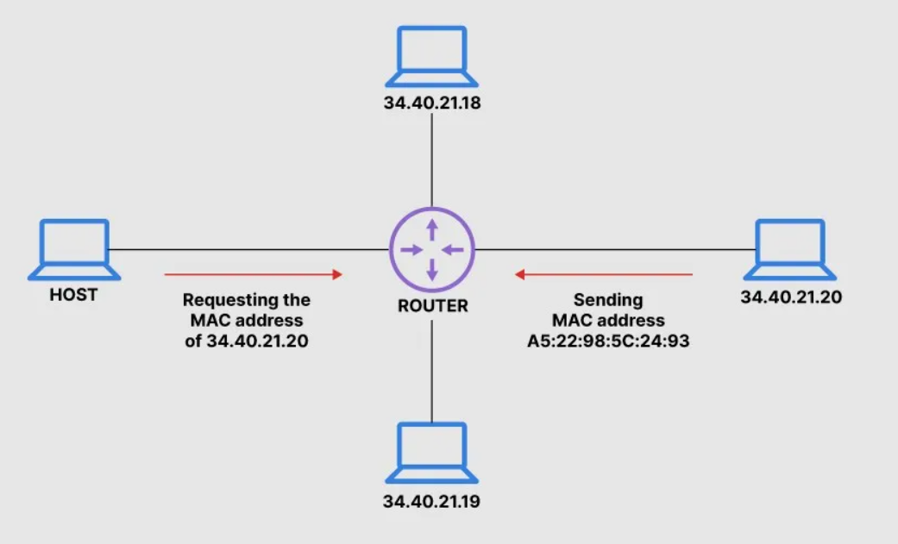

# ARP Poisonig attack using EtterCap

## What is ARP?
ARP stands for Address Resolution Protocol, it’s a protocol that maps a dynamic  IP address to a fixed physical machine address, also known as the MAC address in a LAN network. 
This mapping procedure is very important as the lengths of the IP(32 bits for IPV4) address and MAC(48 bits, hex value) address vary by about 16 bits


## How does ARP work? 

- When a computer joins a LAN network, it receives a unique identification address called the IP address
- Data is exchanged in the form of packets across internet, to deliver the packets to the intended machine a translation of IP addresses to MAC address(Also referred to as Physical Address) is required. 
- The gateway, or the piece of hardware on a network that allows data to flow from one network to another, asks the ARP program(Usually present on a router, maintained in the form of ARP Table) to find a MAC address that matches with the IP address of a machine.
- Upon finding the MAC address corresponding to the IP address, the data packet is delivered to the right machine on the network. 
Point to note: The translation from IP to MAC address is done by the router and this process involves no security or encryption against  ARP table corruption. 

## What is ARP Poisoning? 
ARP Poisoning consists of abusing the vulnerability in ARP to corrupt the MAC-to-IP mappings of other devices on the network. 

Security was not of paramount importance when ARP was introduced back in 1982, hence the designers of the protocol never included any authentication mechanisms to validate ARP messages. Any device on the LAN network could answer to an ARP request, whether the original message was intended for it or not. 

For example, if Computer A “asks” for the MAC address of Computer B, an attacker at Computer C can respond and Computer A would accept this response as authentic. This oversight has made a variety of attacks possible. By leveraging easily available tools, a threat actor can “poison” the ARP cache of other hosts on a local network, filling the ARP cache with inaccurate entries. 

## What is MITM attack
A man in the middle (MITM) attack is a general term for when a perpetrator positions himself in a conversation between a user and an application—either to eavesdrop or to impersonate one of the parties, making it appear as if a normal exchange of information is underway.

The goal of an attack is to steal personal information, such as login credentials, account details and credit card numbers. Targets are typically the users of financial applications, SaaS businesses, e-commerce sites and other websites where logging in is required.

## What is Ettercap?
[Ettercap](https://en.wikipedia.org/wiki/Ettercap_(software)) is originally one of packet analyzers such as wireshark, tcpdump. However, tt is commonly called as a packet sniffer because it is capable of intercepting data streams which flow on computer networks, and these captured packets are decoded and analyzed through proper RFCs or protocols by the tool. Therefore, it can be used as a tool for man-in-the-middle ***(MITM)*** attacks on local area network (LAN). By default, it has the ability to conduct eavesdropping, filter packets and collect passwords. Moreover, its features can be extended by custom plugins using its API as it has plugin suppport. It works by putting its network interface into promiscuous mode (pass its traffic of interface to CPU) and by ***ARP poisoning*** the target machines. It also has the ability to actively or passively find other poisoners on the LAN.

## How does Ettercap work?
Ettercap is basically Unix-like based program. It is installed on Linux, BSD and MacOS. However, Windows is not supported by it. For network interface cards, most network cards can suitable if these works without any problem on OS system. The network card should be promiscuous mode which allows a network interface to pass all traffic through it to CPU for capturing and analyzing data streams. Ettercap is working on wired and wireless local area networks. 

### How to install Ettercap and What settings to be changed to use
On Kali Linux
```
sudo apt install ettercap-common
```
On Ubuntu
```
sudo apt install ettercap-gtk
```
On Fedora
```
sudo yum install ettercap-gtk
```
Before using it, a few settings should be changed in the conf file.
First, ec_uid and ec_gid must be set to 0 in order for the program to work on behalf of the superuser
:

```
sudo vi /etc/ettercap/etter.conf
```

```
ec_uid = 0 # nobody is the default
ec_gid = 0 # nobody is the default
```

### How to use Ettercap (Example: How to start ARP Poisoning)
Please, refer to the below section, how to start ARP Poisoning in the Demo Section.

## Demo - ARP Poisoning with Ettercap
### Scenario


### Environment
- 2 Virtual Machines on VMware
     - Normal User (**Victim**): Windows 10
     - Malicious User (**Attacker**): Kali Linux
- Ettercap installed on Kali Linux
     - Ettercap **Target1**: **Window 10**
     - Ettercap **Target2**: VMware **Gateway**
- Test Web site (**Http**): www.vulnweb.com

### ARP Poisoning Demo Details

**ARP Request and ARP Reply/Response**

1. Target1(W:192.168.163.130-fb-ef) is asking "Who has 192.168.163.2? Tell 192.168.163.130".
2. Ettercap(K:192.168.163.134-f9-35) is sending response to Target1(W:192.168.163.130-fb-ef) that "192.168.163.2 is at 00-50-56-fd-0a-5b". 
3. Also Ettercap(K:192.168.163.134-f9-35) is sending message to Target2(G:192.168.163.2-0a-5b) that "192.168.163.130 is at 00-0c-29-2a-fb-ef". 

It is normal ARP request and ARP reply. However, when ARP Poisoning is started, 

4. Ettercap(K:192.168.163.134-f9-35) is sending to Target1(W:192.168.163.130-fb-ef) that "192.168.163.2 is at 00-0c-29-78-f9-35" which is Ettercap itself MAC address.
5. Also Ettercap(K:192.168.163.134-f9-35) is sending to Target2(G:192.168.163.2-0a-5b) that "192.168.163.130 is at 00-0c-29-78-f9-35".
 
These are fake ARP replies to Target1 and Target2. You can check the captured picture from wireshark as below.


So, with these information, ARP cache table in Target1(Windows10) and Target2(Gateway) is updated as following.

ARP cache table in Target1(Windows10)

| IP            | MAC               |
| ------------- |:-----------------:|
| 192.168.163.2 | 00-0c-29-78-f9-35 |
| 192.168.163.134| 00-0c-29-78-f9-35|

ARP cache table in Target2(Gateway)
| IP            | MAC               |
| ------------- |:-------------:|
| 192.168.163.130| 00-0c-29-78-f9-35|
| 192.168.163.134| 00-0c-29-78-f9-35|

Thus, these targets send all their traffic to Ettercap and it enables Ettercap to sniff them.

Here is also ARP table (Before and After ARP Poisoning) captured on Target1(Windows10)


### How to start ARP Poisoning

These are steps to proceed ARP Poisoning and sniffing on Ettercap from scratch. You can refer to 2 min demo video at the bottom to know the whole process.


## Risk Mitigation

For the prevention methods on security issues, there are several things. First, before logging on websites, you should check if the websites are using HTTPS in the URL. Second, it is better to use secured networks using encrypt protocols like VPN. Plus, you can implement some security solutions or equipment such as IDS(Intrusion Detection Systems) and attacker detection software like ARPcop(Ettercap plugin), etc. Lastly, it is recommended that users keep eyes on security web sites updated with latest information like NVD(NIST), OWASP.org, etc.

## References

https://www.kali.org/tools/ettercap/

https://kalitut.com/how-to-use-ettercap/

https://techgenix.com/Understanding-Man-in-the-Middle-Attacks-ARP-Part2/

https://www.comparitech.com/blog/information-security/arp-poisoning-spoofing-detect-prevent/

https://www.imperva.com/learn/application-security/man-in-the-middle-attack-mitm/

https://www.fortinet.com/resources/cyberglossary/what-is-arp
 
https://www.varonis.com/blog/arp-poisoning 

## Demo Video

https://user-images.githubusercontent.com/94558947/158044956-401f34b2-09ac-4f0c-86c8-eb75f7f5ac92.mp4
